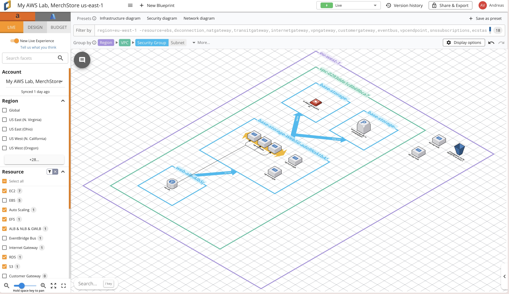
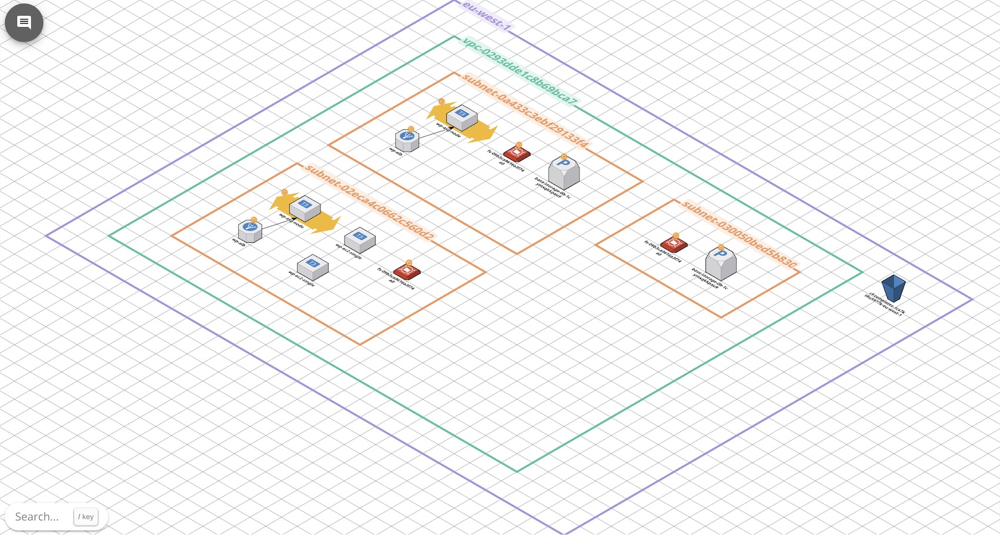
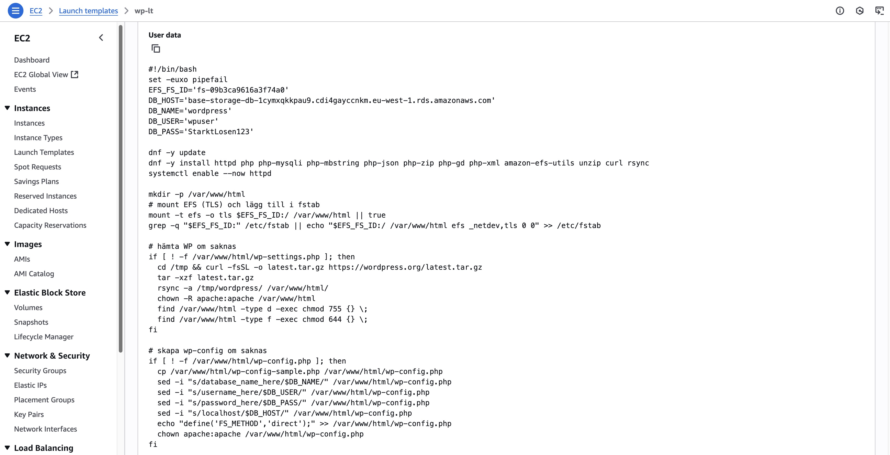
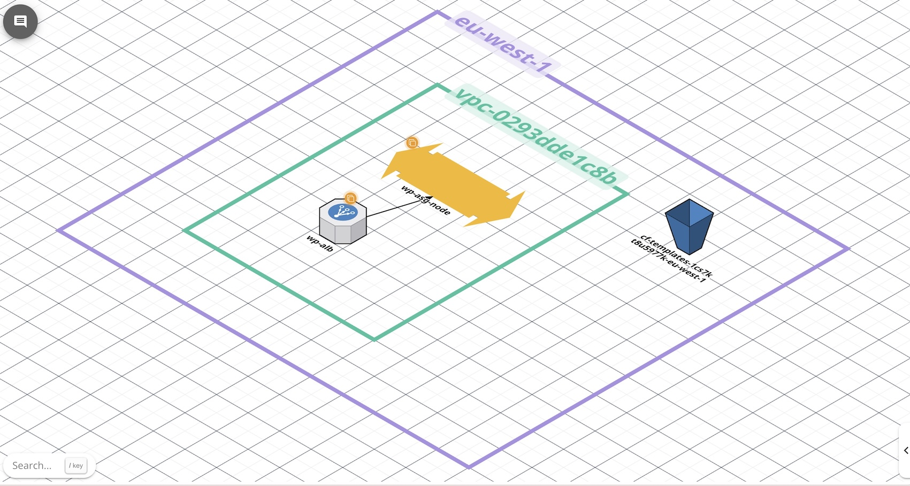
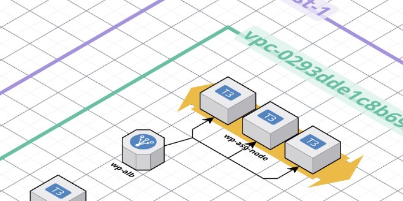
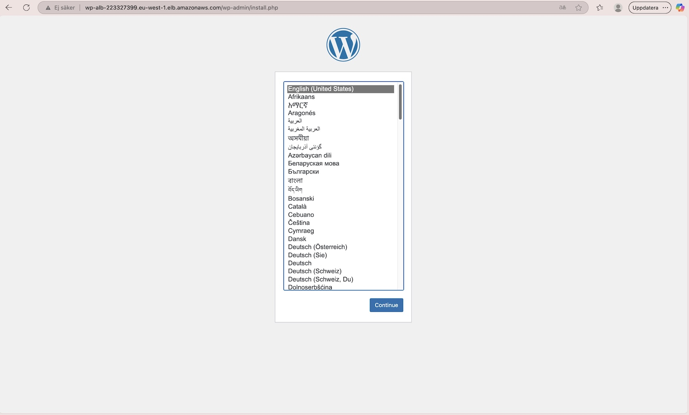
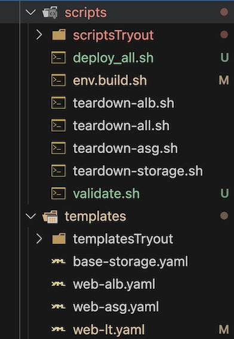
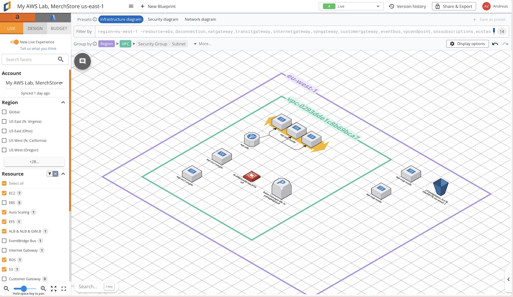
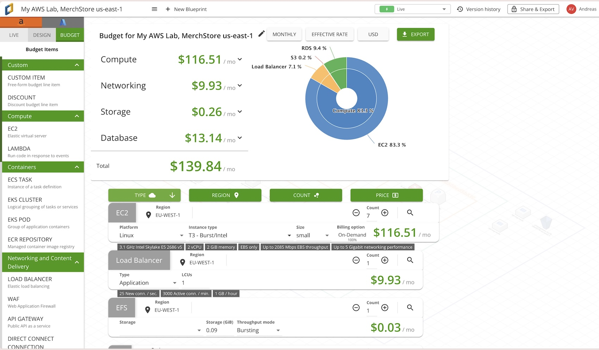

# Tutorial: WordPress Deployment på AWS med CloudFormation

## Introduktion

Denna rapport beskriver hur man steg för steg bygger upp en **WordPress-miljö på AWS** med hjälp av _Infrastructure as Code_ (IaC) via **CloudFormation**.  
Jag kommer att redovisa alla steg från senaste lösningen jag satt upp. Det har varit lärorikt och tufft har slängt flera projekt som jag misslyckats med. Kommer även redovis vilka fel som uppstod och hur jag löste dem. Rapporten fungerar som en tutorial som går att följa för att själv sätta upp en liknande miljö. Dels via rapporten men kommer även att lägga en länk till projektet på github.

## Metod

Mitt mål var att lära mig så mycket som möjligt om de metoder som finns för att lösa uppgiften. Jag har gjort övningsuppgifter i konsolen och anvönde den som referens för att köra nästa steg vilket var att försöka lösa det med Cloudformation dels med hjälp av att ladda upp filer via konsolen och via terminalen och aws CLI och git bash.

---

## Översiktlig arkitektur

Miljön består av följande komponenter:

- **VPC**: En virtuell nätverksmiljö i AWS (här `vpc-0293dde1c8b69bca7`).
- **Subnets**: Två publika subnät (för webbservrar) och två privata (för databas och EFS).
- **Security Groups (SG)**: En Security Group (SG) fungerar som en virtuell brandvägg för dina resurser i AWS. Den styr vilken trafik som får komma in till och ut från dina EC2-instanser, RDS-databaser eller andra resurser.
- **Elastic Compute Cloud (EC2)**: som ligger i olika Avalibility zoner. Genom att sprida resurserna (EC2-instanser) över olika Availability Zones uppnår vi fault tolerance. Om en hel zon blir otillgänglig kan systemet fortfarande köras i de andra zonerna. ALB styr automatiskt om trafiken.
- **Application Load Balancer (ALB)**: Fördelning av trafik:
  ALB kontrollerar vilka instanser som är friska (health checks) och skickar bara trafik till de instanser som svarar korrekt.
  • Health check i ditt fall är /health.txt.
  • Om en instans är unhealthy får den ingen trafik förrän den är frisk igen.

Hög tillgänglighet:
Eftersom dina instanser ligger i olika Availability Zones (AZ) ser ALB till att fördela lasten och skicka om trafiken om en hel zon blir otillgänglig.

- **Auto Scaling Group (ASG)**: Skalar EC2-instanser automatiskt upp/ned. beroende på belastning av systemet
  som vi black friday
- **Launch Template (LT)**: Beskriver hur varje EC2-instans konfigureras. Definierar hur instanserna startas (AMI, instance type, säkerhet m.m.).vad som skall ligga på instanserna när de skapas
- **RDS (MySQL)**: En hanterad MySQL-databas som WordPress använder för innehåll.
- **EFS (Elastic File System)**: Delad filyta mellan alla webbinstanser. har ligger i själva verket själva wordpress filerna
- **S3 bucket**: För backup och lagring av statiska filer.



---

## Ordning för att bygga miljön

När man bygger upp infrastrukturen är det viktigt att ta det i rätt ordning, eftersom resurserna är beroende av varandra:

# One-click IaC – Checklista

## Lokalt (din dator)

1. Kör `env.build.sh` → laddar miljövariabler (VPC, subnät, SG, ALB-ARN m.m.)
2. Kör `deploy-all.sh` → orkestrerar hela kedjan

```bash
chmod +x WP-infra/scripts/env.build.sh
source WP-infra/scripts/env.build.sh
```

```bash
chmod +x WP-infra/scripts/deploy-all.sh
./WP-infra/scripts/deploy-all.sh
```

---

## Templates

### base-storage.yaml

- Skapar Web Security Group
- Exporterar `WEB_SG`



---

### web-lt.yaml (Launch Template)

- Skapar Launch Template
- Exporterar `LT_ID`, `LT_VER`



---

### web-alb.yaml (ALB + Target Group)

- Skapar Application Load Balancer och Target Group
- Exporterar `ALB_SG`, `ALB_DNS`, `TG_ARN`



---

### web-asg.yaml (Auto Scaling Group)

- Skapar Auto Scaling Group
- Kopplar till Launch Template och ALB
- Parametrar: subnät, LT, TG



---

## Verifiering

- Kontroll av hälsa: `aws elbv2 describe-target-health`
- Test i webbläsare: `http://$ALB_DNS`



---

## Teardown (rensning)

- `teardown-asg.sh` → tar bort ASG
- `teardown-alb.sh` → tar bort ALB
- `teardown-storage.sh` → tar bort SG och EFS
- `teardown-all.sh` → kör allt i rätt ordning

För att kunna följa tutorialen

# Tutorial-checklista för WordPress IaC-projektet

## Steg 0 – Förberedelser

1. Skapa en tom arbetsmapp (t.ex. `WP-infra/`).
2. Se till att du har:

   - **AWS CLI** installerat
   - **Ett AWS-konto** med IAM-användare och access keys
   - **En VPC** med publika subnets (kan återanvändas från tidigare labbar)
   - **En key pair** för SSH (t.ex. `myDemokey.pem`)
   - **Git + VS Code** (eller annan IDE)

   I vårt projekt refererar jag till Cloudcraftbilder som projektet är kopplat till.
   men är inget som krävs för att lösa uppgiften, men det visualiserar allt och du kan lätt skapa en mall för hu du vill att din struktur skall se ut. Bilderna är dock kopplat till hur min färdiga lösning ser ut i AWS. Då de är ihopkopplade via en IAM roll för att få en liveuppdatering över din struktur på AWS.

3. Klona projektet eller skapa filstrukturen enligt nedan.

https://github.com/AndreasVilhelmsson/AWS-PROJECT/tree/main



---

## Steg 1 – Sätt miljövariabler

Öppna terminalen i projektroten och kör:

```bash
chmod +x WP-infra/scripts/env.build.sh
source WP-infra/scripts/env.build.sh
```

```sh
# ===== WP-infra/scripts/env.build.sh =====
# Avsedd att SOURCAS i interaktivt skal utan att döda terminalen.

_is_sourced() { [[ "${BASH_SOURCE[0]}" != "${0}" ]]; }
if _is_sourced; then :; else set -euo pipefail; fi

_aws() { command aws "$@" 2>/dev/null || true; }
_say() { printf '%s\n' "$*"; }

export AWS_REGION=${AWS_REGION:-eu-west-1}
_aws configure set region "$AWS_REGION" >/dev/null || true

export VPC_ID=${VPC_ID:-"vpc-0293dde1c8b69bca7"}

SUBNETS=$(_aws ec2 describe-subnets \
  --filters "Name=vpc-id,Values=$VPC_ID" "Name=map-public-ip-on-launch,Values=true" \
  --query "sort_by(Subnets,&AvailabilityZone)[].SubnetId" --output text)
set -- $SUBNETS
export SUBNET_PUBLIC=${1:-}
export SUBNET_PUBLIC_B=${2:-}

export KEYPAIR_NAME=${KEYPAIR_NAME:-"myDemokey"}
export DB_PASSWORD=${DB_PASSWORD:-"StarktLosen123"}

MY_IP=$(curl -s --max-time 2 ifconfig.me || true)
export MY_CIDR="${MY_IP:+$MY_IP/32}"

# Hämta Security Groups, ALB DNS och TargetGroup ARN från CloudFormation exports
export WEB_SG=$(_aws cloudformation list-exports \
  --query "Exports[?Name=='base-storage-WebSgId'].Value" --output text)

export ALB_SG=$(_aws cloudformation list-exports \
  --query "Exports[?Name=='web-alb-AlbSgId'].Value" --output text)

export ALB_DNS=$(_aws cloudformation list-exports \
  --query "Exports[?Name=='web-alb-AlbDnsName'].Value" --output text)

export TG_ARN=$(_aws cloudformation list-exports \
  --query "Exports[?Name=='web-alb-TgArn'].Value" --output text)

export AWS_PAGER=""
export AWSCLI_PAGER=""

_say "Region=$AWS_REGION"
_say "VPC_ID=$VPC_ID"
_say "SUBNET_PUBLIC=$SUBNET_PUBLIC"
_say "SUBNET_PUBLIC_B=$SUBNET_PUBLIC_B"
_say "KEYPAIR_NAME=$KEYPAIR_NAME"
_say "WEB_SG=$WEB_SG"
_say "ALB_SG=$ALB_SG"
_say "ALB_DNS=$ALB_DNS"
_say "TG_ARN=$TG_ARN"
_say "MY_CIDR=$MY_CIDR"

_is_sourced && return 0 || true
# ===== end =====
```

2. **Storage och nätverk**

   - Skapa VPC, subnät, security groups, RDS och EFS.
   - CloudFormation-mall: `templates/base-storage.yaml`

```yaml
   AWSTemplateFormatVersion: '2010-09-09'
Description: "Base storage for WP: SGs + EFS (2x MT) + RDS MariaDB"
Parameters:
  VpcId: { Type: AWS::EC2::VPC::Id }
  PrivateSubnet1Id: { Type: AWS::EC2::Subnet::Id }
  PrivateSubnet2Id: { Type: AWS::EC2::Subnet::Id }
  ClientSubnetId:   { Type: AWS::EC2::Subnet::Id, Description: "Subnet i samma AZ som dina web-noder" }  # <— NY
  DBName: { Type: String, Default: wordpress }
  DBUser: { Type: String, Default: wpuser }
  DBPassword: { Type: String, NoEcho: true, MinLength: 8 }
Resources:
  WebSG:
    Type: AWS::EC2::SecurityGroup
    Properties: { GroupDescription: Web SG, VpcId: !Ref VpcId }
  EfsSG:
    Type: AWS::EC2::SecurityGroup
    Properties: { GroupDescription: EFS SG, VpcId: !Ref VpcId }
  EfsIngressNfs:
    Type: AWS::EC2::SecurityGroupIngress
    Properties: { GroupId: !Ref EfsSG, IpProtocol: tcp, FromPort: 2049, ToPort: 2049, SourceSecurityGroupId: !Ref WebSG }
  DbSG:
    Type: AWS::EC2::SecurityGroup
    Properties: { GroupDescription: RDS SG, VpcId: !Ref VpcId }
  DbIngress3306:
    Type: AWS::EC2::SecurityGroupIngress
    Properties: { GroupId: !Ref DbSG, IpProtocol: tcp, FromPort: 3306, ToPort: 3306, SourceSecurityGroupId: !Ref WebSG }
  EFS:
    Type: AWS::EFS::FileSystem
    Properties: { Encrypted: true }
  MtA:
    Type: AWS::EFS::MountTarget
    Properties: { FileSystemId: !Ref EFS, SubnetId: !Ref PrivateSubnet1Id, SecurityGroups: [!Ref EfsSG] }
  MtB:
    Type: AWS::EFS::MountTarget
    Properties: { FileSystemId: !Ref EFS, SubnetId: !Ref PrivateSubnet2Id, SecurityGroups: [!Ref EfsSG] }
  MtClient:
    Type: AWS::EFS::MountTarget
    Properties:
      FileSystemId: !Ref EFS
      SubnetId: !Ref ClientSubnetId
      SecurityGroups: [!Ref EfsSG]
  DbSubnets:
    Type: AWS::RDS::DBSubnetGroup
    Properties: { DBSubnetGroupDescription: Private subnets, SubnetIds: [!Ref PrivateSubnet1Id, !Ref PrivateSubnet2Id] }
  DB:
    Type: AWS::RDS::DBInstance
    Properties:
      Engine: mariadb
      DBInstanceClass: db.t3.micro
      AllocatedStorage: '20'
      MasterUsername: !Ref DBUser
      MasterUserPassword: !Ref DBPassword
      DBName: !Ref DBName
      PubliclyAccessible: false
      VPCSecurityGroups: [!Ref DbSG]
      DBSubnetGroupName: !Ref DbSubnets
      DeletionProtection: false
Outputs:
  WebSgId:    { Value: !Ref WebSG, Export: { Name: !Sub '${AWS::StackName}-WebSgId' } }
  EfsSgId:    { Value: !Ref EfsSG, Export: { Name: !Sub '${AWS::StackName}-EfsSgId' } }
  DbSgId:     { Value: !Ref DbSG,  Export: { Name: !Sub '${AWS::StackName}-DbSgId' } }
  EfsId:      { Value: !Ref EFS,   Export: { Name: !Sub '${AWS::StackName}-EfsId' } }
  DbEndpoint: { Value: !GetAtt DB.Endpoint.Address, Export: { Name: !Sub '${AWS::StackName}-DbEndpoint' } }
```

3. **Launch Template (LT)**

   - Skapa en AMI eller ange en bas-AMI (Amazon Linux 2023).
   - Beskriv hur EC2-instanser ska konfigureras.
   - CloudFormation-mall: `templates/web-lt.yaml`

```yaml
AWSTemplateFormatVersion: '2010-09-09'
Description: Launch Template for WP nodes mounting EFS at /var/www/html

Parameters:
  KeyPairName:
    Type: AWS::EC2::KeyPair::KeyName
  InstanceType:
    Type: String
    Default: t3.small
  DBPassword:
    Type: String
    NoEcho: true
    MinLength: 8

Resources:
  Lt:
    Type: AWS::EC2::LaunchTemplate
    Properties:
      LaunchTemplateName: wp-lt
      LaunchTemplateData:
        ImageId: !Sub '{{resolve:ssm:/aws/service/ami-amazon-linux-latest/al2023-ami-kernel-6.1-x86_64}}'
        InstanceType: !Ref InstanceType
        KeyName: !Ref KeyPairName
        SecurityGroupIds:
          SecurityGroupIds:
  - !ImportValue web-sg-WebInstanceSgId
        MetadataOptions:
          HttpTokens: required
        UserData:
          Fn::Base64:
            Fn::Sub:
              - |
                #!/bin/bash
                set -euxo pipefail
                EFS_FS_ID='${EfsId}'
                DB_HOST='${DbEndpoint}'
                DB_NAME='wordpress'
                DB_USER='wpuser'
                DB_PASS='${DBPassword}'

                dnf -y update
                dnf -y install --allowerasing httpd php php-mysqli php-mbstring php-json php-zip php-gd php-xml amazon-efs-utils unzip curl rsync
                systemctl enable --now httpd

                mkdir -p /var/www/html
                # mount EFS (TLS) och lägg till i fstab
                mount -t efs -o tls $EFS_FS_ID:/ /var/www/html || true
                grep -q "$EFS_FS_ID:" /etc/fstab || echo "$EFS_FS_ID:/ /var/www/html efs _netdev,tls 0 0" >> /etc/fstab

                # hämta WP om saknas
                if [ ! -f /var/www/html/wp-settings.php ]; then
                  cd /tmp && curl -fsSL -o latest.tar.gz https://wordpress.org/latest.tar.gz
                  tar -xzf latest.tar.gz
                  rsync -a /tmp/wordpress/ /var/www/html/
                  chown -R apache:apache /var/www/html
                  find /var/www/html -type d -exec chmod 755 {} \;
                  find /var/www/html -type f -exec chmod 644 {} \;
                fi

                # skapa wp-config om saknas
                if [ ! -f /var/www/html/wp-config.php ]; then
                  cp /var/www/html/wp-config-sample.php /var/www/html/wp-config.php
                  sed -i "s/database_name_here/$DB_NAME/" /var/www/html/wp-config.php
                  sed -i "s/username_here/$DB_USER/" /var/www/html/wp-config.php
                  sed -i "s/password_here/$DB_PASS/" /var/www/html/wp-config.php
                  sed -i "s/localhost/$DB_HOST/" /var/www/html/wp-config.php
                  echo "define('FS_METHOD','direct');" >> /var/www/html/wp-config.php
                  chown apache:apache /var/www/html/wp-config.php
                fi

                echo "<?php http_response_code(200); echo 'ok';" > /var/www/html/healthcheck.php
              - { EfsId: !ImportValue base-storage-EfsId, DbEndpoint: !ImportValue base-storage-DbEndpoint }

Outputs:
  LaunchTemplateId:
    Description: LaunchTemplate ID
    Value: !Ref Lt
    Export:
      Name: !Sub '${AWS::StackName}-LtId'
```

5. **Application Load Balancer (ALB)**

- Sätt upp en ALB som tar emot trafik på port 80.
- Koppla den till target group.
- CloudFormation-mall: `templates/web-alb.yaml`

```yaml
AWSTemplateFormatVersion: "2010-09-09"
Description: Application Load Balancer for WordPress ASG (HTTP only, healthcheck to /healthcheck.php)

Parameters:
  VpcId:
    Type: AWS::EC2::VPC::Id
    Description: VPC for the ALB
  SubnetAId:
    Type: AWS::EC2::Subnet::Id
    Description: Public subnet A (e.g., eu-west-1a)
  SubnetBId:
    Type: AWS::EC2::Subnet::Id
    Description: Public subnet B (e.g., eu-west-1b)

  # Web SG kommer från basstacken
  WebSgExportName:
    Type: String
    Default: base-storage-WebSgId
    Description: Name of the export that contains the Web Security Group ID

Mappings: {}

Conditions: {}

Resources:
  AlbSg:
    Type: AWS::EC2::SecurityGroup
    Properties:
      GroupDescription: ALB security group (80 from Internet)
      VpcId: !Ref VpcId
      SecurityGroupIngress:
        - IpProtocol: tcp
          FromPort: 80
          ToPort: 80
          CidrIp: 0.0.0.0/0
      SecurityGroupEgress:
        - IpProtocol: -1
          CidrIp: 0.0.0.0/0

  Alb:
    Type: AWS::ElasticLoadBalancingV2::LoadBalancer
    Properties:
      Name: wp-alb
      Scheme: internet-facing
      Type: application
      IpAddressType: ipv4
      Subnets:
        - !Ref SubnetAId
        - !Ref SubnetBId
      SecurityGroups:
        - !Ref AlbSg

  Tg:
    Type: AWS::ElasticLoadBalancingV2::TargetGroup
    Properties:
      Name: wp-tg
      VpcId: !Ref VpcId
      Protocol: HTTP
      Port: 80
      TargetType: instance
      HealthCheckProtocol: HTTP
      HealthCheckPort: traffic-port
      HealthCheckPath: /healthcheck.php
      Matcher:
        HttpCode: "200"

  HttpListener:
    Type: AWS::ElasticLoadBalancingV2::Listener
    Properties:
      LoadBalancerArn: !Ref Alb
      Port: 80
      Protocol: HTTP
      DefaultActions:
        - Type: forward
          TargetGroupArn: !Ref Tg

  # Ingress-regel som tillåter ALB -> WebSG på port 80
  WebIngressFromAlb:
    Type: AWS::EC2::SecurityGroupIngress
    Properties:
      GroupId: !ImportValue
        Fn::Sub: "${WebSgExportName}"
      IpProtocol: tcp
      FromPort: 80
      ToPort: 80
      SourceSecurityGroupId: !Ref AlbSg
      Description: Allow ALB to Web on 80

Outputs:
  AlbDnsName:
    Description: ALB DNS name
    Value: !GetAtt Alb.DNSName
    Export:
      Name: !Sub "${AWS::StackName}-AlbDnsName"

  AlbSgId:
    Description: ALB Security Group ID
    Value: !Ref AlbSg
    Export:
      Name: !Sub "${AWS::StackName}-AlbSgId"

  TgArn:
    Description: Target Group ARN
    Value: !Ref Tg
    Export:
      Name: !Sub "${AWS::StackName}-TgArn"
```


6. **Auto Scaling Group (ASG)**

- Skapa en ASG som använder Launch Template och ALB target group.
- test
- CloudFormation-mall: `templates/web-asg.yaml`

```yaml
AWSTemplateFormatVersion: "2010-09-09"
Description: Auto Scaling Group for WordPress nodes using Launch Template and ALB Target Group

Parameters:
  SubnetAId:
    Type: AWS::EC2::Subnet::Id
    Description: Public subnet A
  SubnetBId:
    Type: AWS::EC2::Subnet::Id
    Description: Public subnet B
  LaunchTemplateId:
    Type: String
    Description: Launch Template ID (e.g. lt-xxxxxxxxxxxxxxxxx)
  LaunchTemplateVersion:
    Type: String
    Description: Launch Template Version (string, e.g. "1")
  TargetGroupArn:
    Type: String
    Description: Import value from web-alb stack (e.g. web-alb-TgArn)

Resources:
  Asg:
    Type: AWS::AutoScaling::AutoScalingGroup
    Properties:
      AutoScalingGroupName: wp-asg
      VPCZoneIdentifier:
        - !Ref SubnetAId
        - !Ref SubnetBId
      MinSize: "2"
      MaxSize: "4"
      DesiredCapacity: "2"
      LaunchTemplate:
        LaunchTemplateId: !Ref LaunchTemplateId
        Version: !Ref LaunchTemplateVersion
      TargetGroupARNs:
        - !Ref TargetGroupArn
      HealthCheckType: ELB
      HealthCheckGracePeriod: 300
      Tags:
        - Key: Name
          Value: wp-asg-node
          PropagateAtLaunch: true

Outputs:
  AsgName:
    Description: Auto Scaling Group name
    Value: !Ref Asg
    Export:
      Name: !Sub "${AWS::StackName}-AsgName"
```


7. **Verifiera WordPress-installation**

- Öppna DNS för ALB (`wp-alb-xxxx.eu-west-1.elb.amazonaws.com`).
- WordPress-installationen startar.


---

## Filer som skapades

### Templates (`WP-infra/templates/`)

- `base-storage.yaml`
- `web-lt.yaml`
- `web-alb.yaml`
- `web-asg.yaml`

## Scripts (WP-infra/scripts/)

### Aktiva filer i projektet

- **env.build.sh**
  Exporterar miljövariabler (t.ex. VPC, subnets, security groups, ALB DNS) så att de kan användas i övriga script.

- **deploy-all.sh**
  Huvudscript som orkestrerar hela flödet. Kör alla CloudFormation-mallar i rätt ordning.

- **validate.sh**
  Validerar att CloudFormation-mallarna (`.yaml`) är syntaktiskt korrekta innan de körs.

TearDown scripten är inget som du behöver för att lösa uppgiften utan mer för att
att visa hur man bakvänt kan ta ner allt för att skapa en ren arbetsyta Du ser dessa filer via github länken i detta dokument.

- **teardown-asg.sh**
  Tar ner Auto Scaling Group (EC2-instanserna).

- **teardown-alb.sh**
  Tar ner Application Load Balancer och dess target group.

- **teardown-storage.sh**
  Tar ner lagringsdelen (RDS/EFS och tillhörande resurser).

- **teardown-all.sh**
  Kör alla teardown-skript i rätt ordning för att rensa hela miljön.

---

## Vanliga fel och lösningar

Under arbetets gång uppstod flera problem som jag löste steg för steg:
Jag har lärt mig mycket samtidigt som det har tagit väldigt lång tid att lösa.

- **SubnetBId does not exist**
  → Orsak: En variabel var tom (`$SUBNET_PUBLIC_B`).
  → Lösning: Uppdatera `env.build.sh` med korrekt script för att plocka två subnät.

- **Template format error**
  → Orsak: YAML-formatfel.
  → Lösning: Validera alltid mallar med `validate.sh` innan deployment.

- **Unhealthy targets i Target Group**
  → Orsak: Några instanser svarade inte på health checks.
  → Lösning: Terminera instansen via ASG (ersätts automatiskt).

- **Bash-terminal kraschar pga BOM**
  → Orsak: `env.build.sh` innehöll dolda tecken (UTF-8 BOM).
  → Lösning: Rensa filen med `perl -i -pe 's/\x{feff}//g' fil.sh`.

---

## Masterfil för one-click deployment

För att slippa köra varje script manuellt skapades en **masterfil**:

- CloudFormation-mall: `scripts/deploy_all.sh`

```sh
#!/usr/bin/env bash
# ============================================================
# WP-infra/scripts/deploy-all.sh
# One-click IaC deploy för WordPress-labbet
# - Validerar mallar
# - Kör stackar i rätt ordning
# - Hämtar outputs/exports (LT_ID/LT_VER/TG_ARN/DNS)
# - Visar en snabb hälsosummary i slutet
# ============================================================

set -euo pipefail

ROOT_DIR="$(cd "$(dirname "${BASH_SOURCE[0]}")/.." && pwd)"
TPL_DIR="${ROOT_DIR}/templates"
SCRIPTS_DIR="${ROOT_DIR}/scripts"

# 1) Ladda miljö (dödar inte terminalen om man råkar köra 'source')
#    -> ger AWS_REGION, VPC_ID, SUBNET_PUBLIC(_B), KEYPAIR_NAME, DB_PASSWORD, m.m.
#    -> plockar även upp ev. tidigare exports (WEB_SG, ALB_* ...)
#    OBS: filen är skriven så fel inte kraschar här; vi gör extra kontroller nedan
# shellcheck source=/dev/null
source "${SCRIPTS_DIR}/env.build.sh"

# -------- Små hjälpfunktioner --------------------------------
log(){ printf "\n\033[1;36m%s\033[0m\n" "$*"; }
warn(){ printf "\033[1;33m%s\033[0m\n" "$*" >&2; }
die(){ printf "\033[1;31mERROR:\033[0m %s\n" "$*" >&2; exit 1; }

need(){
  local name="$1" value="${!1:-}"
  [[ -n "$value" ]] || die "Saknar obligatorisk variabel: ${name}"
}

awsc(){ aws "$@" >/dev/null; }    # “quiet” variant för kontroller
validate_tpl(){ aws cloudformation validate-template --template-body "file://$1" >/dev/null; }

# -------- Grundkrav -------------------------------------------
need AWS_REGION
need VPC_ID
need SUBNET_PUBLIC
need SUBNET_PUBLIC_B
need KEYPAIR_NAME
need DB_PASSWORD

# -------- 0) Validera mallar ----------------------------------
log "Validerar CloudFormation-mallar…"
validate_tpl "${TPL_DIR}/base-storage.yaml"
validate_tpl "${TPL_DIR}/web-lt.yaml"
validate_tpl "${TPL_DIR}/web-alb.yaml"
validate_tpl "${TPL_DIR}/web-asg.yaml"
log "Mallvalidering OK."

# -------- 1) Storage (EFS + SG + ev. DB-endpoint export) ------
log "1/4: Deploy 'base-storage' …"
aws cloudformation deploy \
  --stack-name base-storage \
  --template-file "${TPL_DIR}/base-storage.yaml" \
  --capabilities CAPABILITY_NAMED_IAM \
  --no-fail-on-empty-changeset

# Läs ut export av webb-SG (skapas av base-storage)
WEB_SG="$(aws cloudformation list-exports \
  --query "Exports[?Name=='base-storage-WebSgId'].Value" --output text)"
[[ -n "${WEB_SG}" && "${WEB_SG}" != "None" ]] || die "Hittade inget WebSgId från base-storage."

log "Web SG: ${WEB_SG}"

# -------- 2) Launch Template (userdata, EFS-mount, WP-setup) ---
log "2/4: Deploy 'web-lt' (Launch Template) …"
aws cloudformation deploy \
  --stack-name web-lt \
  --template-file "${TPL_DIR}/web-lt.yaml" \
  --parameter-overrides \
     KeyPairName="${KEYPAIR_NAME}" \
     DBPassword="${DB_PASSWORD}" \
  --no-fail-on-empty-changeset

# Hämta LaunchTemplateId + Version från stackresurserna
LT_ID="$(aws cloudformation describe-stack-resources \
  --stack-name web-lt \
  --query "StackResources[?ResourceType=='AWS::EC2::LaunchTemplate'].PhysicalResourceId" \
  --output text)"
LT_VER="$(aws ec2 describe-launch-templates \
  --launch-template-ids "$LT_ID" \
  --query "LaunchTemplates[0].LatestVersionNumber" --output text)"

need LT_ID
need LT_VER
log "LaunchTemplateId=${LT_ID}  Version=${LT_VER}"

# -------- 3) ALB (SG + ALB + TG + Listener) -------------------
log "3/4: Deploy 'web-alb' …"
aws cloudformation deploy \
  --stack-name web-alb \
  --template-file "${TPL_DIR}/web-alb.yaml" \
  --parameter-overrides \
     VpcId="${VPC_ID}" \
     SubnetAId="${SUBNET_PUBLIC}" \
     SubnetBId="${SUBNET_PUBLIC_B}" \
  --no-fail-on-empty-changeset

# Läs ut exports från web-alb
ALB_SG="$(aws cloudformation list-exports \
  --query "Exports[?Name=='web-alb-AlbSgId'].Value" --output text)"
ALB_DNS="$(aws cloudformation list-exports \
  --query "Exports[?Name=='web-alb-AlbDnsName'].Value" --output text)"
TG_ARN="$(aws cloudformation list-exports \
  --query "Exports[?Name=='web-alb-TgArn'].Value" --output text)"

need ALB_SG
need ALB_DNS
need TG_ARN
log "ALB SG=${ALB_SG}"
log "ALB  DNS=${ALB_DNS}"
log "TG   ARN=${TG_ARN}"

# -------- 4) ASG (kopplar in LT + TG i två AZ) ----------------
log "4/4: Deploy 'web-asg' …"
aws cloudformation deploy \
  --stack-name web-asg-ec2hc \
  --template-file "${TPL_DIR}/web-asg.yaml" \
  --parameter-overrides \
     SubnetAId="${SUBNET_PUBLIC}" \
     SubnetBId="${SUBNET_PUBLIC_B}" \
     LaunchTemplateId="${LT_ID}" \
     LaunchTemplateVersion="${LT_VER}" \
     TargetGroupArn="${TG_ARN}" \
  --no-fail-on-empty-changeset

# -------- Snabb status ----------------------------------------
log "Sammanfattning:"
printf '  %-18s %s\n' "Region:"         "${AWS_REGION}"
printf '  %-18s %s\n' "VPC:"            "${VPC_ID}"
printf '  %-18s %s / %s\n' "Subnets:"   "${SUBNET_PUBLIC}" "${SUBNET_PUBLIC_B}"
printf '  %-18s %s\n' "Web SG:"         "${WEB_SG}"
printf '  %-18s %s (v%s)\n' "LaunchTpl:" "${LT_ID}" "${LT_VER}"
printf '  %-18s %s\n' "ALB DNS:"        "${ALB_DNS}"
printf '  %-18s %s\n' "TG ARN:"         "${TG_ARN}"

log "Target health (kan ta ~1–2 min att bli healthy):"
aws elbv2 describe-target-health --target-group-arn "${TG_ARN}" \
  --query 'TargetHealthDescriptions[].{Id:Target.Id,State:TargetHealth.State,Desc:TargetHealth.Description}' \
  --output table || true

log "Klart! Öppna: http://${ALB_DNS}"
```

---

## Slutsats

Genom att använda **CloudFormation** och **bashscript** lyckades jag automatisera hela flödet för att sätta upp en WordPress-miljö i AWS.  
Arbetet gav mig praktisk erfarenhet av:

- Infrastructure as Code (IaC).
- Att felsöka CloudFormation-fel.
- Att strukturera templates och script för återanvändbarhet.
- Att använda Auto Scaling + ALB för hög tillgänglighet.
- Att använda bashscript för att lösa uppgiften i olika moment



Allt är kopplat till kostnader här är en kalkyl på vad denna lösning hade kostat att ha om man hade behållt följande struktur



---
